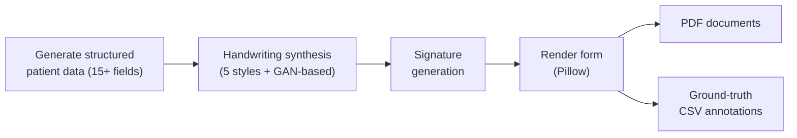

# Synthetic Handwritten Medical Document Generator

A Python pipeline that generates large datasets of **synthetic handwritten medical forms** with matching ground-truth labels, for training and evaluating **OCR and Document AI** models. **All data is synthetic. No real patient information is used.**

## Why this exists

Real medical forms can't be shared or used freely for model training because of privacy, and hand-labelling handwritten documents is slow. This project produces realistic handwritten forms and their exact labels automatically.

## Features

- **10,000+ synthetic forms** generated in one run
- **15+ structured patient fields** per form
- **5 handwriting styles** for visual diversity
- **Realistic signatures**
- **GAN-based handwriting generation** for more natural, varied writing
- **Paired outputs:** every PDF comes with ground-truth annotations in CSV, ready for training, validation and evaluation

## Pipeline



## Tech stack

Python · Pillow (PIL) · NumPy · GANs

## Getting started

```bash
git clone https://github.com/Aadi511/synthetic-medical-document-generator.git
cd synthetic-medical-document-generator
pip install -r requirements.txt
python <main_script>.py
```

## Output

- `PDF` documents: one synthetic handwritten form each
- `CSV` annotations: the true value of every field for every form, aligned to its PDF

## Use cases

- Training OCR / handwriting recognition models
- Training and benchmarking Document AI and information extraction systems
- Building datasets without touching real patient data

## Author

**Aaditya Vijay** · [GitHub](https://github.com/Aadi511)
